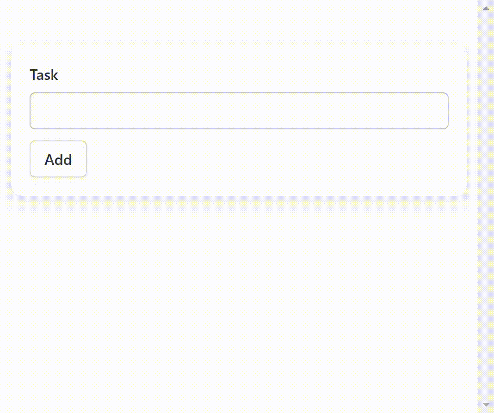
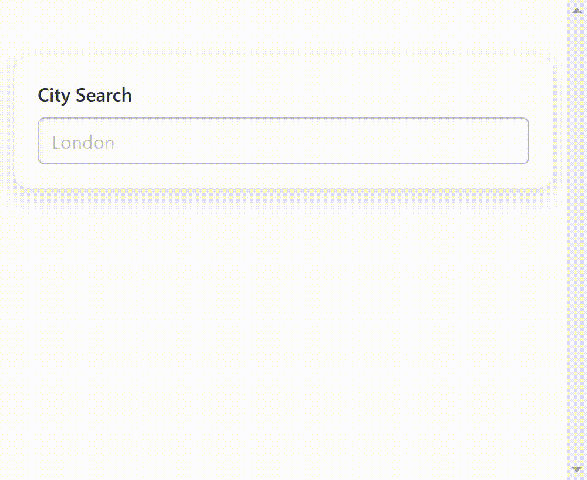
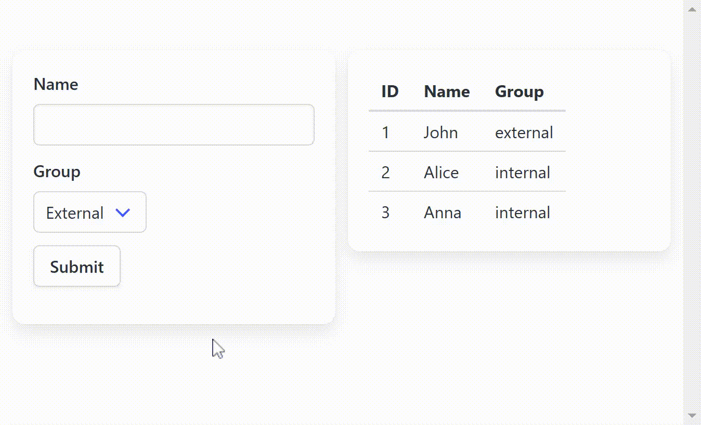

<p align="center">
  
</p>
<p align="center">
  
</p>
<p align="center">
  
  
  
</p>

**LazyFast** is a lightweight Python library for building modern, component-based web interfaces using FastAPI. It handles server-side logic in Python, with interactive elements like inputs and buttons triggering server-side component reloads for dynamic state updates.

<p align="center">
<a href="https://github.com/nikirg/lazyfast/blob/main/DOCS.md">Documentation</a>
/
<a href="https://github.com/nikirg/lazyfast/tree/main/examples">Examples</a>
</p>

<p align="center">
   
   
</p>

**Ideal for Python developers who:**
- Have basic HTML and CSS knowledge and want to build web interfaces without learning complex frontend frameworks like React, Angular, or Vue.

**Suitable for projects that:**
- Have low to medium traffic and can benefit from server-side rendering to offload work from the client's machine. *(Note: High traffic may increase server costs due to backend load.)*
- Require quick prototyping and demos without involving frontend developers. LazyFast offers more flexibility than tools like Streamlit, which can be limiting and produce similar-looking applications.

<p align="center">
   
</p>

**Key Features**

1. **Component-Based Server Rendering**
   - Build interfaces with lazy-loaded components that encapsulate logic, state, and presentation.
2. **Server-Side Logic**
   - Manage interactions and state on the server, reducing client-side complexity.
3. **FastAPI Integration**
   - Components and pages are FastAPI endpoints, supporting dependency injection and other features.
4. **Lightweight**
   - Dependencies: FastAPI for Python and HTMX for JavaScript (included via CDN).
5. **State Management**
   - Use a state manager to trigger component reloads for a reactive user experience.


## Installation

To install LazyFast, use pip:

```bash
pip install lazyfast
```
or
```bash
poetry add lazyfast
```

## Quick Start

Here's an example application to demonstrate how LazyFast works:

```python
from fastapi import FastAPI, Request
from lazyfast import LazyFastRouter, Component, tags


# LazyFastRouter inherits from FastAPI's APIRouter
router = LazyFastRouter()

# Define a lazy-loaded HTML component powered by HTMX
@router.component()
class MyComponent(Component):
    title: str

    async def view(self, request: Request) -> None:
        tags.h1(self.title, class_="my-class")

        with tags.div(style="border: 1px solid black"):
            tags.span(request.headers)

# Initialize the page dependencies for component rendering
# The page endpoint is also a FastAPI endpoint
@router.page("/{name}")
def root(name: str):
    with tags.div(class_="container mt-6"):
        MyComponent(title=f"Hello, World from {name}")

# Embed the router in a FastAPI app
app = FastAPI()
app.include_router(router)
```
If you use `uvicorn` instead as a server and want to reload on changes, use the following command:
```bash
uvicorn app:app --reload --timeout-graceful-shutdown 1
```

## License

LazyFast is licensed under the [MIT License](https://github.com/nikirg/lazyfast/blob/main/LICENSE).


## Roadmap
1. Cache system for HTML tags
2. Component templates with popular CSS frameworks (Bootstrap, Bulma, etc.)
3. Advanced state management
4. Closer integration with HTMX
5. ...
